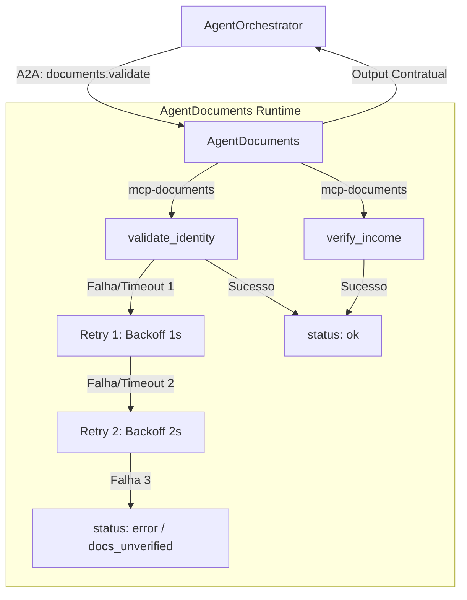

# Proposal: Agente de Validação de Documentos (AgentDocuments)

**Change ID:** add-documents-agent  
**Status:** PROPOSED  
**Autor:** Danilo Amaral  
**Data:** 2026-05-28  

---

## Motivação

O **AgentDocuments** executa a Etapa 2 da sequência A2A do orquestrador, processando os documentos enviados pelo solicitante (identidade e comprovante de renda). Sua função é realizar OCR, validar a consistência do nome impresso no documento com o cadastro do solicitante e extrair/confirmar o valor real da renda.

Sem o AgentDocuments especificado formalmente:
1. O orquestrador depende de mocks locais estáticos (`mock_agents.py`), impedindo a evolução do sistema para processar múltiplos arquivos ou arquivos reais.
2. Não há especificação formal sobre como tratar variações gráficas de nomes (ex: acentuações ou abreviações de sobrenomes).
3. Não há definição contratual sobre o tratamento de falhas e timeouts nas APIs de OCR, que são inerentemente mais lentas e propensas a erros transientes do que consultas simples de banco de dados.

Seguindo o padrão do `AgentBureau`, este agente necessita de uma **política de retry explícita** com backoff de 1s e 2s, com um timeout de 5s por tentativa, dado que o processamento de imagens e PDF é pesado.

---

## Escopo da Mudança

### Incluído
- Identidade, papel e responsabilidades do `AgentDocuments`.
- Engenharia de contexto: isolamento de dados (não recebe score de bureau, nem histórico de compliance) e formato de output.
- Ferramenta MCP: `mcp-documents` com duas ferramentas:
  - `validate_identity`: Valida se o documento de identidade enviado é válido e coincide com o nome cadastrado.
  - `verify_income`: Valida o comprovante de renda (holerite, extrato, etc.) e extrai o valor líquido mensal consolidado.
- Política de retry interno: 2 retries com backoff (1s, 2s) antes de reportar falha técnica definitiva.
- Guides: regras absolutas de validação de nome, tratamento de imagens ilegíveis e anti-exemplos.
- Sensores: métricas de processamento de imagens, taxa de erro por tipo de documento e custos de OCR.
- Prompt de sistema derivado da spec (SPDD).
- Suite de evals com Promptfoo (`documents.yaml`).

### Excluído
- Integração real com motores OCR comerciais (ex: Google Cloud Document AI, AWS Textract).
- Implementação interna do servidor de arquivos e download de mídias.
- Configuração do cache do Sensedia AI Gateway para payloads de arquivos binários.

---

## Design de Alto Nível

---

## Comparação de Sub-agentes Runtimes

| Característica | AgentCompliance | AgentBureau | AgentDocuments |
| :--- | :--- | :--- | :--- |
| **Ordem de Execução** | Etapa 4 (Pós-Risco) | Etapa 1 (Inicial) | Etapa 2 (Pós-Bureau) |
| **Timeout por Tentativa**| 3s | 3s | 5s (Processamento de OCR) |
| **Política de Retry** | Zero retries | 2x backoff (1s, 2s) | 2x backoff (1s, 2s) |
| **Comportamento em Falha**| Recusa Imediata (`rejected`) | Fallback HITL (`bureau_unavailable`) | Fallback HITL (`docs_unverified`) |
| **Ferramentas MCP** | `mcp-kyc` (3 ferramentas) | `mcp-bureau` (1 ferramenta) | `mcp-documents` (2 ferramentas) |

---

## Impacto em Specs Existentes

| Spec | Tipo de Impacto | Descrição |
| :--- | :--- | :--- |
| `credit-analysis/spec.md` | ADDED | Adiciona a seção detalhada do `AgentDocuments` e a especificação das ferramentas `mcp-documents`. |

---

## Critérios de Aceite deste Proposal

- [ ] Delta Spec do `AgentDocuments` documentada e revisada.
- [ ] Schema completo das ferramentas `validate_identity` e `verify_income` definido.
- [ ] Regras de tolerância a variações gráficas de nomes descritas formalmente.
- [ ] Prompt de sistema (SPDD) com prioridades de decisão bem definidas.
- [ ] Suite de 8 casos de teste configurada no Promptfoo (`documents.yaml`), cobrindo sucesso, falha transiente com retry, divergência de nomes e robustez adversarial.
