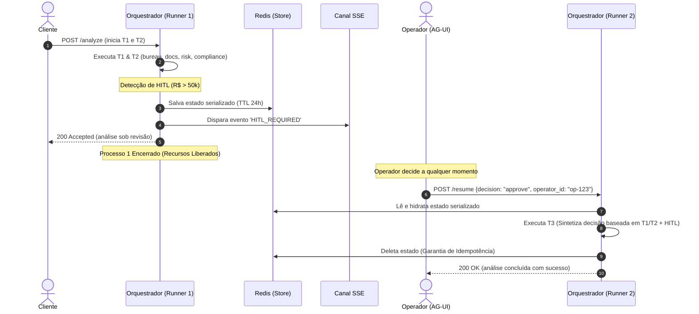

# Proposal: Human-in-the-Loop (HITL) Assíncrono

**Change ID:** hitl-async
**Status:** PROPOSED
**Autor:** Danilo Amaral
**Data:** 2026-06-01

---

## Problema

Atualmente, o processo de aprovação humana (Human-in-the-Loop - HITL) para solicitações de crédito de alta complexidade ou de valor elevado (acima de R$ 50.000) é **síncrono**. Durante o fluxo, o processo Python que executa o agente fica bloqueado (em espera ativa ou sleep) aguardando que o operador de mesa de crédito tome uma decisão.

Este comportamento síncrono apresenta as seguintes limitações críticas:
1. **Desperdício de Recursos de Computação:** Processos Python da aplicação ficam ocupados na memória RAM/CPU sem processar nada, apenas bloqueados aguardando uma ação humana que pode levar minutos, horas ou dias.
2. **Impede a Escala Horizontal:** Como o estado é mantido em memória no processo síncrono, se o runner da aplicação for reiniciado, atualizado ou sofrer um rebalanceamento de carga, a análise é perdida e o processo falha de forma irrecuperável. Não há resiliência ou suporte a failover distribuído.
3. **Bloqueio de Conexões e SLA:** Conexões síncronas de longa duração travam portas de rede, gerando timeouts no Sensedia AI Gateway e no Client, degradando a performance agregada de concorrência do sistema.

---

## Solução Proposta

Transicionar o HITL para um fluxo **assíncrono** baseado em pausa, serialização de estado e retomada:
1. **Pausa & Serialização (Runner 1):** Ao atingir o critério de HITL (exceder o limite de R$ 50.000 ou falha operacional não compliance), o Agente Orquestrador pausa a execução, serializa todo o estado intermediário acumulado (Turnos T1 e T2) e salva temporariamente em um armazenamento altamente disponível (Redis).
2. **Desconexão / Fim de Processo:** O processo Python original que iniciou a análise é encerrado imediatamente de forma limpa, liberando todos os recursos da máquina física/container.
3. **Notificação da AG-UI (SSE):** O sistema emite um evento do tipo `HITL_REQUIRED` via Server-Sent Events (SSE) para notificar o painel do frontend (`AG-UI`) sobre a necessidade de decisão do operador.
4. **Mesa de Crédito Decidindo:** O analista humano analisa a requisição, visualiza o histórico no painel (`AG-UI`) no seu próprio tempo, e emite a decisão.
5. **Retomada - POST `/resume` (Runner 2):** O painel do operador faz uma chamada ao endpoint `POST /resume` fornecendo a decisão, justificativa e o identificador do operador.
6. **Hidratação e Execução T3:** Um novo processo orquestrador é instanciado, valida a requisição, hidrata o estado serializado anteriormente no Redis e executa diretamente o Turno 3 (T3 - decision_synthesize, contratos e saídas) sem re-executar as ferramentas caras e demoradas de T1 e T2 (evitando novas cobranças de bureaus de crédito externos e re-execução desnecessária de LLM).

---

## Escopo e Impacto

### Componentes Afetados
- **`src/orchestrator.py`:** Refatorado para interromper a execução após T2 no caso de HITL e aceitar a reinicialização de T3 a partir de um estado hidratado.
- **Novo componente `src/hitl_store.py`:** Camada de serviço responsável por interagir com o Redis, gerenciar a serialização em JSON, desserialização e manipulação do TTL.
- **Novo endpoint `POST /resume`:** Endpoint HTTP exposto na API para que a AG-UI envie as decisões do operador.
- **`evals/trajectory.yaml` / PromptFoo:** Adaptação ou acréscimo de cenário `hitl_async` cobrindo o novo fluxo de ponta a ponta.

### Fora de Escopo
- Desenvolvimento do painel visual frontend (`AG-UI`).
- Implementação de SSE Server de produção fora do mock de eventos.

---

## Riscos e Mitigações

1. **Risco:** O estado serializado não conter dados suficientes, obrigando o orquestrador a re-executar T1/T2 durante o resume.
   - *Mitigação:* Desenhar um JSON Schema estrito contendo exatamente os retornos brutos de `bureau_get_score`, `documents_validate`, `risk_evaluate` e `compliance_check`.
2. **Risco:** Duplicidade de processamento no endpoint `/resume` (concorrência e falhas de idempotência).
   - *Mitigação:* Usar transações atômicas no Redis (`GETSET` ou deleção imediata na leitura) baseadas em `request_id` como trava de idempotência.
3. **Risco:** Vazamento de dados confidenciais (ex: CPF) no Redis.
   - *Mitigação:* O Redis armazenará apenas dados que já passaram pelo processo de mascaramento no orquestrador (ex: `cpf_masked`). Nenhum dado sensível em texto claro (PII) trafegará de forma insegura.

---

## Decisão Solicitada

Aprovação para o prosseguimento da modelagem arquitetural detalhada (incluindo o schema do Redis, contratos do `/resume`, especificações de SSE e SLAs) descrita nos documentos `design.md` e `spec.md`.
